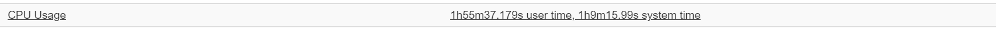
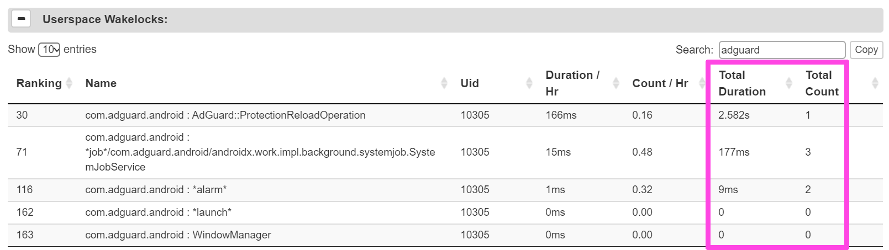

###### バッテリー消費

# 概要
バッテリー消費が実際のところどうなのか実使用で調べる。  
[AdGuard公式](https://kb.adguard.com/en/android/solving-problems/battery)見解と同様CPU時間だけにフォーカスし、シンプルに按分して考える。  

# もの・こと

## 環境
- OS: Android 10
- App: AdGuard for Android 3.4

## 方法・条件
1. `adb shell dumpsys batterystats --reset` で実測開始  
2. 実使用  
3. 実測完了。 `adb bugreport` でデータ取得  
4. Battery Historianでデータ表示  
  
DNSフィルタリング＝ON、HTTPSフィルタリング＝OFF、自動更新＝OFF、ウォッチドッグ＝0。  
_※AdGuardにDNSフィルタリングだけを担当させる想定_

# 結果
モバイルで6時間実測（Screen-on Time 2.5時間）。  
Bluetooth出力で音楽再生、主にブラウザーでニュースや調べ物など。  

全体のCPU時間はユーザー時間＝1h55m37.179s、システム時間＝1h9m15.99s  

AdGuardのCPU時間はユーザー時間＝1m7.73s、システム時間＝36.83s  

設定          | 全体         | AdGuard | 割合
---           |          ---:|     ---:|  ---:
ユーザー時間  | 1h55m37.179s | 1m7.73s | 0.976%
システム時間  | 1h9m15.99s   |  36.83s | 0.886%

## Wakelock,Alarm
ムダに起こしてないかも見ておく。  
全体のUserspace Wakelock。  

AdGuardのUserspace Wakelock。  

Alarmは0だった。スクショ取り忘れた

# 所感

思っていたよりもCPU時間は少なかった。AndroidのVpnService自体も動いているはずだが未確認である。  
条件に「DNSフィルタリングだけを担当させる想定」としたものの`pref.vpn.ipv*.bypass`はOFFのままだったことに[気づいた](https://egg.5ch.net/test/read.cgi/android/1609797897/682)ので機会があれば確認したい。
  
ちなみに3.4以降で[DNSフィルタリングが大きく変更されている](https://adguard.com/ja/blog/adguard-3-4-for-android.html)ことから、3.3以前の環境においては参考にならないと思われる。

# 参考
- AdGuard for Android: <https://adguard.com/adguard-android/overview.html>
- Battery Historian: <https://developer.android.com/studio/profile/battery-historian>  
Docker image - `gcr.io/android-battery-historian/stable:3.1`
