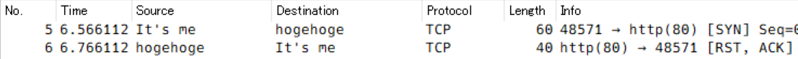
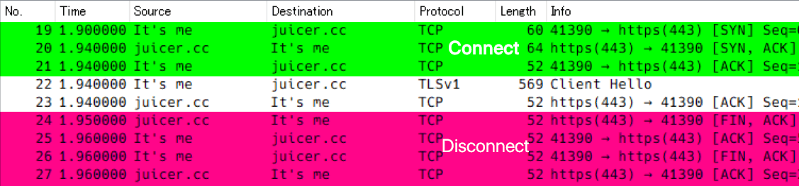

###### コネクションの挙動

# 概要
Local VPN使用時のコネクションについて調べてみる。  
1つ目はFirewallで通信をブロックする動作。AFWall+(iptables)でのブロックとはAppの動作が違ったため。  
2つ目は`HTTPSフィルタリング＝OFF`でのhttpsアクセスでネットワークブロック（`||example.com^`）する動作。DNSブロックしない時に何が起きているか。  

# もの・こと

## 環境
- OS: Android 10
- App: AdGuard for Android 3.4
- Tool: Tasker 5.9.2

## 方法・条件
`pref.vpn.capture＝ON`にしてキャプる。  

# 結果

## Firewallブロック

TCPコネクションを蹴っている。AFWall+ではタイムアウトしているように、AdGuardのFirewallではすぐさま応答が返るように見えるのはここに違いがありそう。  

### 追記１
AFWall+での設定は`REJECT reject-with icmp-port-unreachable`でDROP同様のようなので`REJECT reject-with tcp-reset`を追加してみたが上手くいかない。

```sh
iptables -I OUTPUT -m owner --uid-owner NNNNN -p tcp -j REJECT --reject-with tcp-reset
```

### 追記２

上手くいかないのは誤ってINPUTチェインに追加したまま試したのが原因だった。  
なお前述コマンドではテストのため`-I OUTPUT`しているが、AFWall+のカスタムスクリプトなら`-A afwall`でよい。  

## ネットワークブロック

_#19-21_  
3-way handshaking。  
_#22-23_  
ここでSNIが見えるのでAdGuardはブロック対象のドメイン名かをチェックしてるはず。HTTPだとおそらくヘッダーチェック。  
_#24-27_  
Graceful Close。RSTで切断かとも予想したがそれだとブラウザーやアプリがリトライしちゃうのかも。  

# 参考
- AdGuard for Android: <https://adguard.com/adguard-android/overview.html>
- Tasker: <https://tasker.joaoapps.com/>
