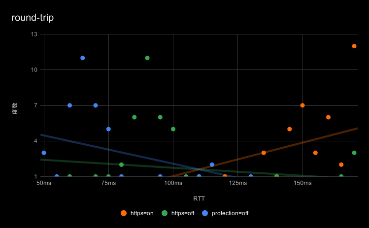

###### HTTPSアクセスのRTT実測

# 概要
`HTTPSフィルタリング＝ON`で使用した際にブラウザの表示が遅いと感じ使うのを止めてしまった経緯があるため、RTTを実測し`HTTPSフィルタリング＝OFF`および`プロテクション=OFF(App個別)`と比較し（自分で）納得するために調べてみる。

# もの・こと

## 環境
- OS: Android 10
- App: AdGuard for Android 3.4
- Tool: HTTPing 2.5 (on Termux 0.94)

## 方法・条件
次の各設定でHTTPingから`https://www.yahoo.co.jp`に対し3秒間隔で40回連続試行。
DNSフィルタリング＝OFF、ステルスモード＝ON、フィルターはAdGuard Base, AdGuard Tracking Protection, 280Blocker（とその他いくつかあったはず）を使用。
1. `HTTPSフィルタリング＝ON`
2. `HTTPSフィルタリング＝OFF`
3. `プロテクション=OFF(App個別)`

使用コマンド

```sh
httping -l -c 40 -i 3 -M https://www.yahoo.co.jp | tee /storage/emulated/0/Download/httping.json
```

### 注記
全設定で同時実施できないため試行時刻のずれは許容する。  
サンプルが少ないが面倒なので傾向が見えれば良しとする。

# 結果
設定毎にRTT平均・中央値をまとめる。単位はms  

設定                           | 平均値 | 中央値
---                            |    ---:|   ---:
`HTTPSフィルタリング＝ON`      | 159.58 | 155.08
`HTTPSフィルタリング＝OFF`     |  97.81 |  89.68
`プロテクション=OFF(App個別)`  |  68.30 |  64.24

`プロテクション=OFF(App個別)`を基準にすると`HTTPSフィルタリング＝OFF`は1.4倍、`HTTPSフィルタリング＝ON`は2倍を超える時間がかかっている。

RTTを5ms単位区切りにし度数分布表を作成、散布図にしたものが以下。視覚化したくて作ったが使い方があっているのか不明。


## 内訳
設定毎にセクション別で中央値をまとめる。単位はms。  

設定                           | resolve | connect |   ssl   |  write | request | close
---                            |     ---:|     ---:|     ---:|    ---:|     ---:|   ---:
`HTTPSフィルタリング＝ON`      |    2.51 |  118.33 |    0.11 |   0.83 |   30.50 |  0.17
`HTTPSフィルタリング＝OFF`     |    2.53 |   63.89 |    0.05 |   0.81 |   21.83 |  0.20
`プロテクション=OFF(App個別)`  |    2.45 |   41.34 |    0.02 |  14.63 |   10.60 |  0.22

`resolve`は名前解決。主に`getaddrinfo()`。  
`connect`はTCP 3-way handshakingからTLS session negotiationまでのうち`ssl`を除いた分。  
`ssl`はSSL/TLS関連と思うが短すぎな気がする。openssl分からん。  
`write`はGETリクエスト送信完了（ACK受信？）まで。
`request`はレスポンス受信完了まで。`write`と合算した方が比較しやすい。  
`close`はディスクリプターの`close()`（Graceful Close？）まで。

# 所感

1ドメインの接続だけでも特にコネクション周りで結構な差が観測できた。WEBページ閲覧では多くのケースでクリティカルパスに複数ドメインが存在するので体感できるのは納得した。  
サンプル数が少ないせいか一部怪しい結果があるものの傾向は見えたので良しとする。  
ちなみにTFO(TCP Fast Open)も試したかったがバグるので諦めた。

# 参考
- AdGuard for Android: <https://adguard.com/adguard-android/overview.html>
- HTTPing : <https://www.vanheusden.com/httping/>
- Termux : <https://termux.com/>
